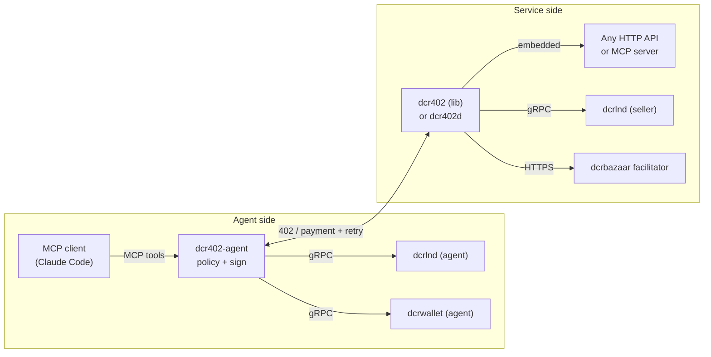

# dcr402: Decred payments for MCP servers and agents

x402 v2 envelope | L402 mechanics | dcrlnd rails.

dcr402 makes Decred a payment rail for HTTP APIs and MCP servers. It carries
L402 payment mechanics inside the x402 v2 wire format over Decred's Lightning
Network, so an agent can pay for a call and a service can verify it with no
human in the loop. [`/scheme`](scheme/) holds the specification, [`/lib`](lib/)
the seller middleware, [`dcr402d`](gateway/) a standalone gateway,
[`dcr402-agent`](agent/) the buyer daemon, and [`dcrbazaar`](bazaar/) a
non-custodial facilitator. Integration guides are in [`docs/`](docs/).

## What is this

AI agents increasingly pay for what they use (an API call, a tool invocation, a
satellite image) without a human in the loop.
[x402](https://github.com/x402-foundation/x402) gives that interaction a wire
format: an HTTP 402 challenge an agent can satisfy programmatically.
[L402](https://github.com/lightninglabs/L402) gives it Lightning-native payment
mechanics: invoice, macaroon, and preimage.

dcr402 puts Decred on that map. DCR over the Lightning Network provides instant,
final, non-custodial micropayments per call; on-chain DCR provides credit
top-ups, so the slow rail funds the fast rail. One 402 response speaks both
protocols: x402 v2 headers for the agent ecosystem, and classic
`WWW-Authenticate` challenges for existing L402/LSAT clients. Same invoice, same
verification, two envelopes.

Nothing in the default path is custodial. Buyers hold their own keys behind a
policy daemon; sellers run their own `dcrlnd` with an invoice-scoped macaroon. A
facilitator exists for sellers who want zero infrastructure, as an explicit,
clearly labeled opt-in.

## System map



## Components

| Directory | Component | Role |
|---|---|---|
| [`scheme/`](scheme/) | the standard | `exact`/Decred scheme spec, L402 dual-envelope annex, test vectors |
| [`lib/`](lib/) | `dcr402` | Go middleware: gate, envelopes, verification, token mint, store |
| [`agent/`](agent/) | `dcr402-agent` | agent-side wallet, policy, and signing daemon (wallet as MCP server) |
| [`gateway/`](gateway/) | `dcr402d` | standalone reverse-proxy gateway with MCP-aware routing |
| [`bazaar/`](bazaar/) | `dcrbazaar` | verify/settle/supported plus a discovery index, non-custodial (T2) |
| [`examples/`](examples/) | examples | gated net/http API, gated MCP server, integration walkthroughs |

## Trust topologies

Deployments choose one of three trust shapes:

- **T1, peer-to-peer (default).** Buyer's dcrlnd pays seller's dcrlnd. No third
  party anywhere. Pure L402 semantics.
- **T2, verify-assisted.** Seller runs dcrlnd but delegates verification
  bookkeeping and discovery listing to a `dcrbazaar` facilitator. The facilitator
  sees payment metadata only; it never holds funds.
- **T3, custodial receive (explicit opt-in).** Seller has zero DCR
  infrastructure. The facilitator's node receives payments, credits the seller,
  and sweeps on-chain to the seller's address on a schedule. Custody runs from
  receipt to sweep and is published honestly; sweep thresholds are low by
  default.

| | key exposure | third party | seller infra | finality |
|---|---|---|---|---|
| T1 Lightning | none (scoped macaroons both sides) | none | dcrlnd | instant |
| T2 | none | facilitator sees metadata | dcrlnd | instant |
| T3 | none (buyer); facilitator holds seller float | custody until sweep | none | instant pay, delayed payout |
| on-chain top-up | none | none (or facilitator watch) | dcrd or facilitator | 1-2 confirmations |

## How a payment flows (per-call, T1)

1. Agent calls a paid resource; the service replies `402` carrying an x402 v2
   `PAYMENT-REQUIRED` header and classic `LSAT`/`L402` challenges. One fresh
   invoice from the seller's dcrlnd sits behind all three.
2. `dcr402-agent` checks the charge against its owner-set policy: allowlists,
   budgets, per-call caps, and escalation to the owner above thresholds.
3. It pays the invoice through the agent's own dcrlnd and obtains the preimage,
   cryptographic proof of payment; funds are final immediately.
4. It retries with the proof (`PAYMENT-SIGNATURE` header). The service verifies
   the preimage against its own node, with no third party, and serves the
   response plus a reusable L402 token.
5. Subsequent calls present the token: pay once, access N times within the TTL.

## Specifications

- [`scheme/scheme_exact_dcr.md`](scheme/scheme_exact_dcr.md): the `exact`
  payment scheme on Decred. Lightning and on-chain transfer methods, wire
  formats, verification rules, security model.
- [`scheme/l402-dual-envelope.md`](scheme/l402-dual-envelope.md): server
  behavior for emitting x402 v2 and L402/LSAT challenges from one 402, L402
  token minting, and precedence rules.
- [`scheme/test-vectors/`](scheme/test-vectors/): deterministic vectors for
  every wire artifact, with self-contained verification tooling.

## Testing

Offline suites (no nodes required):

```
(cd lib && go test ./...)                            # library: all packages
(cd gateway && go test ./...)                        # dcr402d integration tests
python3 scheme/test-vectors/tools/check_vectors.py   # spec test-vector checks
```

Live acceptance against real dcrd and dcrlnd nodes with real payments (details
in [`examples/simnet/`](examples/simnet/)):

```
./examples/simnet/harness.sh start        # bring up the local simnet rig
./examples/simnet/harness.sh e2e          # library: per-call and top-up/credits
./examples/simnet/harness.sh gateway-e2e  # dcr402d: proxy, MCP transport, top-up, burns
./examples/simnet/harness.sh agent-e2e    # dcr402-agent: MCP tools, policy, fetch_paid, on-chain, approval
./examples/simnet/harness.sh agent-demo   # interactive: seeds activity, leaves the dashboard live
./examples/simnet/harness.sh stop         # tear down (clean deletes state too)
```

`agent-demo` leaves the whole stack running and serves the **dcr402-agent web
dashboard at `http://127.0.0.1:20970/`**: open it to watch the live payment
feed, budget gauges, and approve a pending payment yourself. (The standalone
`dcr402-agent` binary defaults its dashboard to `127.0.0.1:9377`; the harness
uses `20970`.)

Each e2e exits 0 with a `PASS` line; component logs are under
`~/.dcr402-simnet/logs/`.

## Relationship to upstream projects

- **[x402-foundation/x402](https://github.com/x402-foundation/x402)**: the
  envelope. `scheme/scheme_exact_dcr.md` follows the house style of
  `specs/schemes/exact/` for upstream contribution.
- **[lightninglabs/L402](https://github.com/lightninglabs/L402)**: the payment
  mechanics. dcr402 servers emit spec-conformant L402/LSAT challenges and accept
  standard L402 credentials.
- **[decred/dcrlnd](https://github.com/decred/dcrlnd)**: the rails. Sellers need
  `invoice.macaroon` only; buyers a payment-scoped macaroon. Exact permission
  lists ship with each component.

## License

ISC. See [LICENSE](LICENSE).
