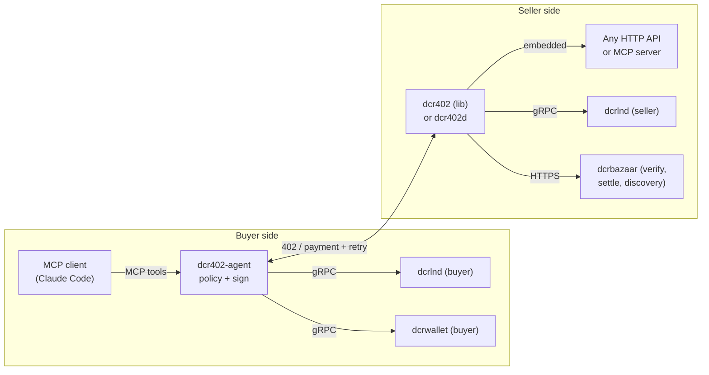

# Architecture

This chapter describes the dcr402 suite: its components, how they relate, the
trust topologies, and the end-to-end payment flows. The authoritative wire
specification is `../scheme/`.

## What the suite is

dcr402 lets software agents pay for HTTP and MCP resources in Decred (DCR),
with no human in the loop on the fast path. It puts Decred on the x402
protocol (an HTTP 402 payment envelope) using L402 payment mechanics
(invoice, macaroon, preimage) over the Decred Lightning Network. A single
402 response speaks both protocols at once, so both client populations work
against one invoice.

Nothing in the default path is custodial. Buyers hold their own keys behind
a policy daemon; sellers run their own dcrlnd with a scoped macaroon.

## Components

| Directory | Name | Side | Role |
|---|---|---|---|
| `../scheme` | the scheme | wire | The `exact` payment scheme on Decred for x402 v2, plus the L402 dual-envelope annex and deterministic test vectors. |
| `../lib` | dcr402 | seller | Go middleware a service embeds to charge DCR: challenge generation, verification, token minting, credit ledger, SQLite store. |
| `../gateway` | dcr402d | seller | A reverse-proxy daemon that fronts any HTTP API or Streamable-HTTP MCP server from YAML, with no code. Wraps the lib. |
| `../agent` | dcr402-agent | buyer | A wallet-as-MCP-server daemon: an agent spends DCR through it within owner-set policy, with human approval escalation over Bison Relay. |
| `../facilitator` | dcrbazaar | infra | Facilitator for the standard x402 v2 verify, settle, and supported endpoints, plus a discovery index of DCR-payable services. Non-custodial (T2). |

## System map

The buyer's `dcr402-agent` holds a payment-scoped dcrlnd macaroon (Lightning
rail) and a dedicated dcrwallet account (on-chain rail). The seller's `lib`
or `dcr402d` holds an invoice-scoped dcrlnd macaroon. Neither side exposes a
spending key to the agent that drives it.

## Trust topologies

A deployment picks one of three trust shapes. The lib and gateway run T1
directly; dcrbazaar adds the non-custodial T2. T3, custodial receive, is an
explicit opt-in.

- T1, peer to peer (default). The buyer's dcrlnd pays the seller's dcrlnd.
  No third party. Pure L402 mechanics: the seller verifies the preimage
  against its own node.
- T2, verify-assisted. The seller runs dcrlnd but delegates verification
  bookkeeping and discovery listing to a facilitator (dcrbazaar). The facilitator
  verifies the preimage statelessly, with the same checks the seller's own gate
  applies, and sees payment metadata only. It never holds funds or keys.
- T3, custodial receive (explicit opt-in). The seller has no DCR
  infrastructure. The facilitator's node receives payments, credits the
  seller, and sweeps on-chain on a schedule. Custody exposure is real
  between receipt and sweep, and is documented as such. See `security.md`.

### Trust matrix

| | Key exposure | Third party | Seller infra | Finality |
|---|---|---|---|---|
| T1 Lightning | none (scoped macaroons both sides) | none | dcrlnd | instant |
| T2 | none | facilitator sees metadata | dcrlnd | instant |
| T3 | none for the buyer; facilitator holds seller float | custody until sweep | none | instant pay, delayed payout |
| On-chain top-up | none | none, or facilitator watch | dcrd or facilitator | 1 to 2 confirmations |

## Wire protocol, in brief

The formal specification is `../scheme/scheme_exact_dcr.md`. The essentials:

- One payment scheme, `exact`, on the Decred networks identified by CAIP-2:
  `bip122:298e5cc3d985bfe7f81dc135f360abe0` (mainnet),
  `bip122:a649dce53918caf422e9c711c858837e` (testnet3),
  `bip122:6bef82c645999585f7255cb02672921a` (simnet, development only).
- Two transfer methods, selected per offer by `extra.assetTransferMethod`:
  `lightning` (per-call, instant, proof is the invoice preimage) and
  `onchain` (credit top-ups, proof is a txid, 1 to 2 confirmations).
- x402 v2 headers carry everything; response bodies stay free:
  - `PAYMENT-REQUIRED` (server to client, on the 402): base64 of a
    `PaymentRequired` object holding `accepts[]` entries.
  - `PAYMENT-SIGNATURE` (client to server, on retry): base64 of a
    `PaymentPayload` echoing the chosen entry plus `{preimage, paymentHash}`.
  - `PAYMENT-RESPONSE` (server to client, on 200): base64 of a
    `SettlementResponse`.
- The same 402 also carries classic L402 challenges so older clients work:
  `WWW-Authenticate: LSAT macaroon="...", invoice="..."` followed by the
  same line with the `L402` keyword. See `../scheme/l402-dual-envelope.md`.
- Amounts are atoms as decimal strings. 1 DCR = 1e8 atoms = 1e11 milli-atoms.
  A Lightning invoice encodes milli-atoms; the decoded value must equal the
  `amount` field times 1000.

## End-to-end flows

### F1, per-call payment (T1, the canonical path)

1. The agent calls a paid resource. The seller replies 402 with the
   `PAYMENT-REQUIRED` header and the two `WWW-Authenticate` challenges,
   behind one fresh invoice from the seller's dcrlnd.
2. dcr402-agent checks the charge against owner policy (allowlists, caps,
   budgets), then pays the invoice through the buyer's dcrlnd and obtains
   the 32-byte preimage. Funds have now moved.
3. The agent retries with the `PAYMENT-SIGNATURE` header. The seller hashes
   the preimage, decodes and binds the invoice, confirms the node settled,
   consumes the payment hash once, and serves the response plus a reusable
   L402 credential.
4. Subsequent calls present that credential and skip payment until its TTL.

### F2, credit top-up (on-chain funds the fast rail)

1. The agent calls the top-up endpoint. The seller replies 402 offering both
   a Lightning invoice and a fresh on-chain deposit address, minted over one
   credential account.
2. The agent broadcasts a transaction paying the exact amount to the
   address, then retries with the txid. Below the required depth the seller
   answers 402 with `insufficient_confirmations` (retryable).
3. At depth the seller credits the account and returns the credential.
   Credit-gated calls then burn the balance with no payment in the hot path.

### F3, facilitator-backed (zero-infrastructure seller)

The custodial topology (T3). A tool call yields a payment-required challenge
whose invoice the facilitator generated on the seller's behalf; the
facilitator's node receives the payment, credits the seller, and settles. The
seller never runs a node. In the non-custodial topology (T2) the seller keeps
its own node and delegates only verification bookkeeping and discovery listing
(see the trust topologies above).

### F4, approval escalation

When F1 step 2 exceeds the owner's approval threshold, the agent does not
pay. It records the attempt, notifies the owner over Bison Relay (and the
web dashboard), and returns `pending_approval` to the caller immediately. On
the owner's reply of `yes <id>` the payment executes asynchronously and is
re-checked against policy; `no <id>` denies; `no <id> freeze` denies and
blocks the agent; an unanswered timeout denies. See `../agent/README.md`.

## Where to read next

- The formal wire spec: `../scheme/scheme_exact_dcr.md`.
- The dual envelope and token minting: `../scheme/l402-dual-envelope.md`.
- The consolidated security model: `security.md`.
- Terms: `glossary.md`.
- Worked integrations: `examples/`.
