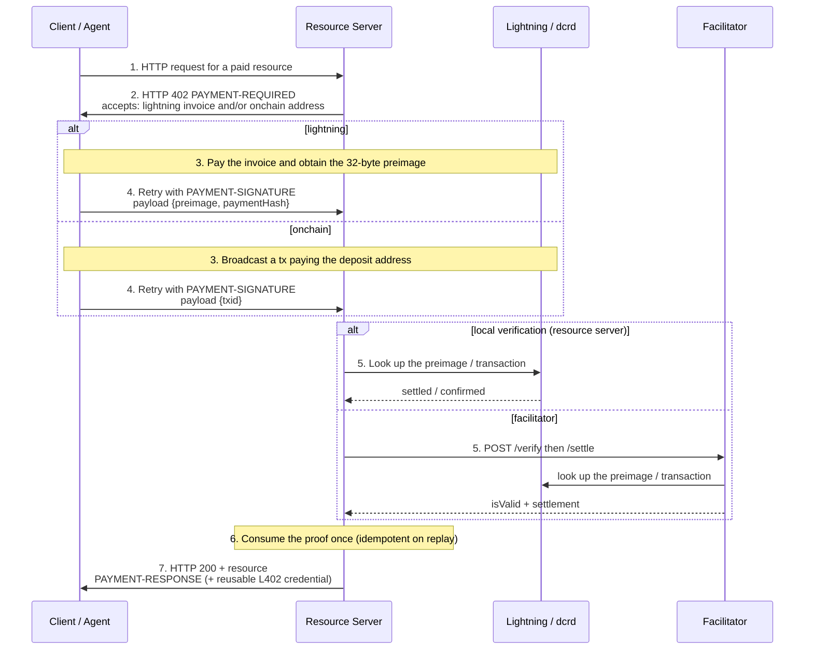

# Exact Payment Scheme for Decred (`exact`)

This document specifies the `exact` payment scheme on the Decred network for
the [x402 payment protocol, version 2](https://github.com/x402-foundation/x402/blob/main/specs/x402-specification-v2.md).
It defines two asset transfer methods: `lightning` (Decred Lightning Network - 
instant, final micropayments suited to per-call pricing) and `onchain`
(on-chain DCR transactions - minutes-scale finality suited to credit top-ups).

The key words "MUST", "MUST NOT", "REQUIRED", "SHALL", "SHOULD", "SHOULD NOT",
"RECOMMENDED", "MAY", and "OPTIONAL" in this document are to be interpreted as
described in [RFC 2119](https://www.rfc-editor.org/rfc/rfc2119).

## Scheme Name

`exact`

## Payment Model

Decred payments under this scheme are **pre-paid**: for both transfer methods,
**funds move before the client sends the retry request**. The payment payload
carries *proof of a payment that has already settled* - a Lightning preimage
or an on-chain transaction id - rather than an authorization for a party to
execute later. There is nothing for a facilitator to broadcast.

| Property | `lightning` | `onchain` |
|---|---|---|
| Payment execution | Client's Lightning node settles the invoice before the retry | Client broadcasts and confirms a transaction before the retry |
| Proof of payment | 32-byte invoice preimage | Transaction id |
| Fee payer | Payer (Lightning routing fees) | Payer (transaction fee) |
| Finality | Instant and irrevocable on HTLC settlement | Probabilistic; 1-2 confirmations required |

Because payment precedes verification, the party that checks a payload - the
**verifier** - performs only local cryptographic checks and node/chain
lookups. The verifier is the resource server itself when it operates its own
`dcrlnd`/`dcrd` (the default, trust-minimized deployment), or a facilitator
acting on the resource server's behalf via the standard `/verify` and
`/settle` endpoints.

## Asset Transfer Methods

The transfer method is selected per `accepts` entry via
`extra.assetTransferMethod`. Because the two methods use disjoint `payTo`,
`extra`, and `payload` shapes, **`extra.assetTransferMethod` is REQUIRED in
every `accepts` entry for this scheme on Decred - there is no implicit
default.**

| Method | Use | Proof | Latency | Suited for |
|---|---|---|---|---|
| `lightning` | Per-call payments | preimage | sub-second | Micropayments, pay-per-tool-call |
| `onchain` | Credit top-ups | txid | minutes (1-2 confirmations) | Funding a credit balance; never per-call |

A resource server MAY offer both methods by listing two `accepts` entries that
differ in `extra.assetTransferMethod` (and in their method-specific fields). A
client MUST construct its `PaymentPayload` for exactly one offered entry and
MUST echo that entry verbatim as `accepted` (see
[PaymentPayload](#paymentpayload-for-exact)).

### Tradeoffs

`lightning`:

- Settlement is instant and final: once the payer's node receives the
  preimage, the HTLC has irrevocably settled. There is no reorg risk and no
  confirmation wait.
- Requires the payer to hold channel liquidity toward the payee (directly or
  via routing). A payment can fail with no route found; the on-chain method
  is the fallback that funds the fast rail.
- Amounts are bounded by channel capacity; well suited to the
  sub-DCR-per-call range.

`onchain`:

- Works with nothing but a funded wallet - no channels, no routing.
- Finality is probabilistic and slow relative to a per-call budget
  (Decred targets 5-minute blocks). This method MUST NOT be used for
  per-call gating; it exists to fund credit balances ("the slow rail funds
  the fast rail").
- Each challenge requires a fresh deposit address from the payee
  (see [Verification Rules](#verification-rules-must)).

### Choosing a Method

- Servers pricing individual calls SHOULD offer `lightning` only, optionally
  alongside an `onchain` top-up endpoint that grants credits.
- Servers offering credit top-ups SHOULD offer both: `lightning` for small
  instant top-ups, `onchain` for larger ones.
- Clients SHOULD prefer `lightning` when they can route the amount, and fall
  back to `onchain` top-ups when routes are unavailable or the amount
  justifies on-chain fees.

## Network Identifier (CAIP-2)

x402 v2 requires [CAIP-2](https://github.com/ChainAgnostic/CAIPs/blob/main/CAIPs/caip-2.md)
network identifiers. Decred uses the registered
[`bip122`](https://github.com/ChainAgnostic/namespaces/blob/main/bip122/caip2.md)
namespace, whose chain reference is the first 32 hexadecimal characters (16
bytes) of the chain's genesis block hash in display byte order - the same
derivation used by Bitcoin, Litecoin, and Dogecoin.

| Network | Genesis block hash | CAIP-2 identifier |
|---|---|---|
| Decred mainnet | `298e5cc3d985bfe7f81dc135f360abe089edd4396b86d2de66b0cef42b21d980` | `bip122:298e5cc3d985bfe7f81dc135f360abe0` |
| Decred testnet3 | `a649dce53918caf422e9c711c858837e08d626ecfcd198969b24f7b634a49bac` | `bip122:a649dce53918caf422e9c711c858837e` |
| Decred simnet | `6bef82c645999585f7255cb02672921ac2f5492820090cd635fe3a59d16b4f87` | `bip122:6bef82c645999585f7255cb02672921a` |

The simnet identifier exists for development and test vectors only and MUST
NOT be advertised by publicly reachable services.

### Lightning Invoice Prefix Binding

Decred BOLT11 invoices carry a network-specific human-readable prefix
([dcrlnd `zpay32`](https://github.com/decred/dcrlnd/tree/master/zpay32)):

| Network | Invoice prefix |
|---|---|
| mainnet (`bip122:298e5cc3...`) | `lndcr` |
| testnet3 (`bip122:a649dce5...`) | `lntdcr` |
| simnet (`bip122:6bef82c6...`) | `lnsdcr` |
| regnet | `lnrdcr` (not supported by this scheme) |

Verifiers MUST reject a payload whose invoice prefix does not correspond to
the `network` of the accepted requirements entry.

> Note: the `1` that follows the prefix-and-amount is the bech32 separator,
> not part of the amount - `lndcr241...` is a 24 DCR invoice, not 241 of
> anything.

## Protocol Flow



### `lightning`

1. Client requests a paid resource.
2. Resource server creates a fresh invoice on its Lightning node for the
   price of the resource and responds `402 Payment Required` with a
   `PaymentRequired` object whose `accepts` entry carries the invoice and its
   payment hash in `extra`.
3. Client validates the challenge: the offered `amount` against its policy,
   `extra.paymentHash` against the decoded invoice's payment hash (`p`
   field), the invoice's destination, amount, network prefix, and expiry.
4. Client pays the invoice through its own Lightning node and obtains the
   32-byte preimage. **Funds have now irrevocably moved.**
5. Client retries the request with a `PaymentPayload` whose `payload` is
   `{preimage, paymentHash}` and whose `accepted` echoes the chosen entry.
6. The verifier performs the checks in
   [Verification Rules](#verification-rules-must) - purely local: hash the
   preimage, decode the invoice, compare.
7. The resource server records the settlement (consuming the payment hash),
   serves the resource with a `SettlementResponse`, and - if it implements
   the [L402 dual envelope](l402-dual-envelope.md) - a reusable credential.

Failure paths: policy denial (step 3) ends the flow before any payment;
route-not-found (step 4) is signaled to the client's operator with the
`onchain` top-up as remediation; invoice expiry before payment requires a
fresh challenge.

### `onchain`

1. Client requests a top-up (or other resource priced for on-chain payment).
2. Resource server generates a **fresh, never-before-used deposit address**,
   stores the (address, amount, resource) challenge record, and responds
   `402` with `payTo` set to that address.
3. Client broadcasts a transaction paying exactly `amount` atoms to `payTo`
   and waits for the required confirmation depth.
4. Client retries with `payload` = `{txid}`.
5. The verifier locates the transaction, checks address, amount, and depth
   per [Verification Rules](#verification-rules-must).
6. If the transaction is valid but not yet at depth, the server responds
   `402` with `PAYMENT-RESPONSE` carrying
   `{"success": false, "errorReason": "insufficient_confirmations"}` - a
   retryable condition; the client polls by re-sending the same retry
   request.
7. At depth, the server records the settlement and serves the response
   (typically a credit grant).

## x402 v2 Headers

All protocol data rides in HTTP headers; response bodies remain free for
content. Header values are the **standard base64 encoding (RFC 4648 section 4, with
padding) of the object's UTF-8 JSON serialization**. The v1 `X-PAYMENT*`
headers and body-borne challenges are legacy and not used by this scheme.

| Header | Direction | Content |
|---|---|---|
| `PAYMENT-REQUIRED` | server -> client, on `402` | `PaymentRequired` |
| `PAYMENT-SIGNATURE` | client -> server, on retry | `PaymentPayload` |
| `PAYMENT-RESPONSE` | server -> client, on `200` (or retryable `402`) | `SettlementResponse` |

### MCP Transport

For payable MCP tools, this scheme uses the standard
[x402 MCP transport](https://github.com/x402-foundation/x402/blob/main/specs/transports-v2/mcp.md)
unchanged: a tool call requiring payment returns a tool result with
`isError: true` carrying the `PaymentRequired` object in **both**
`structuredContent` (as an object) and `content[0].text` (its JSON string
serialization - both REQUIRED by the transport). The client retries the tool
call with the `PaymentPayload` in `params._meta["x402/payment"]`; the server
acknowledges settlement in `result._meta["x402/payment-response"]`.

The `resource.url` for a tool SHOULD be the server's public streamable-HTTP
MCP endpoint (e.g. `https://api.example.com/mcp`), with the per-tool
identity carried by the bazaar extension's `info.input.toolName` - this is
what a facilitator catalogs, and the discovery tuple
`(resource.url, toolName)` stays globally unique
([bazaar extension](https://github.com/x402-foundation/x402/blob/main/specs/extensions/bazaar.md)).
A seller with no public endpoint falls back to the host-less
`mcp://tool/<name>` convention from the transport spec examples. Either
way, settlement binds to the per-tool key `mcp://tool/<name>` (plus the
priced amount), never to the shared endpoint URL, so a proof minted for one
tool cannot settle another.

## `PaymentRequirements` for `exact`

### `lightning` Example

```json
{
  "scheme": "exact",
  "network": "bip122:298e5cc3d985bfe7f81dc135f360abe0",
  "amount": "250000",
  "asset": "DCR",
  "payTo": "03e7156ae33b0a208d0744199163177e909e80176e55d97a2f221ede0f934dd9ad",
  "maxTimeoutSeconds": 3600,
  "extra": {
    "assetTransferMethod": "lightning",
    "invoice": "lndcr2500u1pvjluezpp5qt2yngclhvn8ere496vk3fu78e0ujhqmh649qt7kg48tmedyhmwqdpqv33hydpsxgsxwmmvv3jkugrkv43hgmmjxqrrssdztqxz9z9ys3q59ml9270ej0t9wt62442s3tzzldns0a6j247qkkqzakysm9yz75xqze4a7r3h7tsys8tcugay7f8sru2l8a7s07srcqc5t8f7",
    "paymentHash": "02d449a31fbb267c8f352e9968a79e3e5fc95c1bbeaa502fd6454ebde5a4bedc"
  }
}
```

(The example invoice is the deterministic [golden vector](test-vectors/invoices.json):
0.0025 DCR, 1-hour expiry, preimage `0x11` x 32. Its destination key is a
published test key - never send funds to it.)

### `onchain` Example

```json
{
  "scheme": "exact",
  "network": "bip122:298e5cc3d985bfe7f81dc135f360abe0",
  "amount": "100000000",
  "asset": "DCR",
  "payTo": "DsQxuVRvS4eaJ42dhQEsCXauMWjvopWgrVg",
  "maxTimeoutSeconds": 3600,
  "extra": {
    "assetTransferMethod": "onchain",
    "confirmations": 2,
    "credential": "<base64 challenge macaroon>"
  }
}
```

(Documentation address only - never send funds to it.)

### Field Definitions

| Field | Value for this scheme |
|---|---|
| `scheme` | MUST be `"exact"`. |
| `network` | One of the [Decred CAIP-2 identifiers](#network-identifier-caip-2). |
| `amount` | Required payment in **atoms** as a decimal string; see [Amount Formatting](#amount-formatting). |
| `asset` | MUST be `"DCR"`, the native asset symbol. Decred's native asset has no contract address; the literal symbol follows the precedent of native-asset networks (e.g. XRPL's `"XRP"`). |
| `payTo` | Method-specific; see below. |
| `maxTimeoutSeconds` | Method-specific; see below. |
| `extra` | Method-specific; see below. |

#### `lightning` fields

| Field | Definition |
|---|---|
| `payTo` | The payee Lightning node's identity public key: 33-byte compressed secp256k1, lowercase hex (66 characters). The invoice's destination MUST be this key. |
| `maxTimeoutSeconds` | Time budget for completing payment and retry. Issuers MUST set the invoice expiry (`x` field) to at least this value and SHOULD set them equal. |
| `extra.assetTransferMethod` | MUST be `"lightning"`. |
| `extra.invoice` | A BOLT11 invoice for exactly `amount`, generated fresh for this challenge and never reused. |
| `extra.paymentHash` | The invoice's payment hash (`p` field): 32 bytes, lowercase hex. Stated redundantly so clients and stateless verifiers need not decode the invoice to correlate challenge and proof. |

#### `onchain` fields

| Field | Definition |
|---|---|
| `payTo` | A standard Decred address for the challenge's network, generated fresh for this challenge and never reused. |
| `maxTimeoutSeconds` | Time budget for the transaction to reach the required depth. With 5-minute target blocks, values below 1800 are NOT RECOMMENDED for `confirmations: 2`. |
| `extra.assetTransferMethod` | MUST be `"onchain"`. |
| `extra.confirmations` | OPTIONAL. Confirmation depth the verifier will require (default policy: 1 for small amounts, 2 otherwise; see verification rule 11). |
| `extra.credential` | REQUIRED. The base64 challenge macaroon (the account credential), delivered only to this 402's recipient. On-chain data carries no payer secret, so this per-challenge value is what binds the settlement to the payer: because `accepted` MUST equal the offered entry (rule 1), a chain observer who reconstructs the entry from the public transaction cannot supply it and is rejected with `invalid_payment_requirements`. |

## Amount Formatting

### Atoms

`amount` is a decimal string of **atoms**, Decred's atomic unit:
1 DCR = 100,000,000 atoms (10^8). The string MUST be a positive integer with
no leading zeros, no sign, and no decimal point.

### BOLT11 Invoice Amounts

Decred Lightning invoices encode **milli-atoms** (m-atoms):
1 atom = 1,000 m-atoms; 1 DCR = 10^11 m-atoms.

**Equality rule.** The decoded invoice amount in m-atoms MUST equal
`amount x 1000` exactly. Corollaries:

- An invoice without an amount (a "donation" invoice) MUST be rejected.
- Comparison MUST use decoded m-atom values, never the human-readable prefix
  string: BOLT11 admits multiple encodings of one amount (`2500u` ==
  `2500000n`).

Worked example (the invoice above):

| Representation | Value |
|---|---|
| DCR | 0.0025 |
| `amount` (atoms) | `"250000"` |
| invoice m-atoms | 250,000,000 |
| BOLT11 prefix | `lndcr2500u` (2500 uDCR) |

## `PaymentPayload` for `exact`

### `lightning` Example

```json
{
  "x402Version": 2,
  "resource": {
    "url": "https://api.example.com/v1/process"
  },
  "accepted": {
    "scheme": "exact",
    "network": "bip122:298e5cc3d985bfe7f81dc135f360abe0",
    "amount": "250000",
    "asset": "DCR",
    "payTo": "03e7156ae33b0a208d0744199163177e909e80176e55d97a2f221ede0f934dd9ad",
    "maxTimeoutSeconds": 3600,
    "extra": {
      "assetTransferMethod": "lightning",
      "invoice": "lndcr2500u1pvjluezpp5qt2yngclhvn8ere496vk3fu78e0ujhqmh649qt7kg48tmedyhmwqdpqv33hydpsxgsxwmmvv3jkugrkv43hgmmjxqrrssdztqxz9z9ys3q59ml9270ej0t9wt62442s3tzzldns0a6j247qkkqzakysm9yz75xqze4a7r3h7tsys8tcugay7f8sru2l8a7s07srcqc5t8f7",
      "paymentHash": "02d449a31fbb267c8f352e9968a79e3e5fc95c1bbeaa502fd6454ebde5a4bedc"
    }
  },
  "payload": {
    "preimage": "1111111111111111111111111111111111111111111111111111111111111111",
    "paymentHash": "02d449a31fbb267c8f352e9968a79e3e5fc95c1bbeaa502fd6454ebde5a4bedc"
  }
}
```

### `onchain` Example

```json
{
  "x402Version": 2,
  "resource": {
    "url": "https://api.example.com/v1/topup"
  },
  "accepted": {
    "scheme": "exact",
    "network": "bip122:298e5cc3d985bfe7f81dc135f360abe0",
    "amount": "100000000",
    "asset": "DCR",
    "payTo": "DsQxuVRvS4eaJ42dhQEsCXauMWjvopWgrVg",
    "maxTimeoutSeconds": 3600,
    "extra": {
      "assetTransferMethod": "onchain",
      "confirmations": 2
    }
  },
  "payload": {
    "txid": "<64 lowercase hex characters>"
  }
}
```

### Payload Fields

| Method | Field | Definition |
|---|---|---|
| `lightning` | `preimage` | The settled invoice's 32-byte preimage, lowercase hex. |
| `lightning` | `paymentHash` | The invoice's payment hash, lowercase hex. Redundant with `accepted.extra.paymentHash`; both MUST match. |
| `onchain` | `txid` | The confirmed transaction's id, lowercase hex, in standard display byte order. |

`accepted` MUST equal the chosen `accepts` entry from the challenge - 
**including `extra`, and therefore the invoice itself**. This makes
verification self-contained: a stateless verifier (facilitator `/verify`)
receives the invoice and the preimage in a single request and can perform
every cryptographic check without prior knowledge of the challenge. Clients
SHOULD echo `resource` from the challenge.

A complete lightning `PaymentPayload` with an embedded invoice serializes to
roughly 1.5 KB of base64 - comfortably inside common proxy header limits
(8 KB defaults).

## Verification Rules (MUST)

A verifier MUST apply all of the following, rejecting with the given
`errorReason` (see [Failure Modes](#failure-modes)) on the first failure.

### 1. Envelope Checks

Reject unless:

- `x402Version` equals `2` (`invalid_x402_version`);
- `accepted.scheme` equals `"exact"` (`invalid_scheme`);
- `accepted.network` is a supported Decred CAIP-2 identifier
  (`invalid_network`);
- `accepted` is equal to a `PaymentRequirements` entry the resource server
  offered for this resource - every field, including `extra`
  (`invalid_payment_requirements`);
- `accepted.amount` is a positive-integer decimal string and
  `accepted.asset` equals `"DCR"` (`invalid_payment_requirements`);
- `accepted.extra.assetTransferMethod` is `"lightning"` or `"onchain"`, and
  the method-specific `extra` and `payload` fields for that method are
  present and well-formed (`invalid_payload`).

### 2. Method Dispatch

Apply rules 3-8 for `lightning`, rules 9-12 for `onchain`.

### 3. Preimage Check (`lightning`)

`payload.preimage` MUST be exactly 32 bytes of hex, and
`SHA-256(preimage)` MUST equal both `payload.paymentHash` and
`accepted.extra.paymentHash` (`invalid_exact_decred_payload_preimage_mismatch`).
This is the scheme's core cryptographic primitive: knowledge of the preimage
is transferred to the payer if and only if the payee's node settled the
invoice.

### 4. Invoice Decode and Network Binding (`lightning`)

`accepted.extra.invoice` MUST decode as a valid Decred BOLT11 invoice
(`invalid_exact_decred_invoice_decode`). Its human-readable prefix MUST
correspond to `accepted.network` per the
[prefix binding table](#lightning-invoice-prefix-binding)
(`invalid_exact_decred_invoice_network_mismatch`). Its payment hash (`p` field)
MUST equal `accepted.extra.paymentHash`
(`invalid_exact_decred_invoice_hash_mismatch`).

### 5. Destination Binding (`lightning`)

The invoice's destination node key - the `n` tagged field when present,
otherwise the public key recovered from the invoice signature - MUST equal
`accepted.payTo` (`invalid_exact_decred_invoice_destination_mismatch`). This
binds the proof to the intended payee: a preimage for an invoice issued by
any other node does not verify.

### 6. Amount Equality (`lightning`)

The decoded invoice amount in m-atoms MUST equal `accepted.amount x 1000`
(`invalid_exact_decred_invoice_amount_mismatch`). Amountless invoices MUST be
rejected (same code). See [Amount Formatting](#amount-formatting).

### 7. Expiry (`lightning`)

The invoice's effective expiry is its creation timestamp plus its `x` field
(default 3600 seconds when absent, per BOLT11). Verifiers MUST reject proofs
presented for challenges they no longer consider live
(`invalid_exact_decred_invoice_expired`). A Lightning node never settles an
expired invoice, so possession of the preimage itself proves in-window
settlement; this rule exists so a verifier also refuses stale
re-presentations long after the fact (see rule 8 and
[Security Considerations](#security-considerations)).

### 8. Settlement State and Replay (`lightning`)

The **mint of record** - the party operating the payee node or its
facilitator - SHOULD confirm the invoice state is settled on the node
(`LookupInvoice`) rather than relying on the preimage alone; this is the
distinction between "someone knows the preimage" and "my node was paid".

The resource server MUST enforce **payment-hash uniqueness**: the first
successful presentation of a payment hash consumes it. A subsequent
`PAYMENT-SIGNATURE` carrying the same payment hash MUST NOT re-execute the
paid operation. Within a bounded window the server SHOULD respond
idempotently with the original `SettlementResponse` (the payment hash is a
natural idempotency key, compatible with the
[`payment-identifier` extension](https://github.com/x402-foundation/x402/blob/main/specs/extensions/payment_identifier.md));
after the window it MUST reject with
`invalid_exact_decred_payment_hash_reused`.

The resource server MUST also correlate the payment hash with a challenge
record it actually issued for this resource, at this price
(`invalid_exact_decred_unknown_payment_hash`). Cryptographic validity alone does
not prove the payment was for *this* resource; that binding lives in the
issuer's challenge store. (A stateless facilitator `/verify` performs rules
1-7; challenge correlation and replay accounting remain the resource
server's responsibility, or the facilitator's when it also generated the
challenge.)

### 9. Address Binding and Uniqueness (`onchain`)

The transaction identified by `payload.txid` MUST include at least one output
paying `accepted.payTo` (`invalid_exact_decred_address_mismatch`). Issuers MUST
generate a fresh address per challenge and MUST NOT reuse addresses across
challenges; payments to a reused address are outside this scheme's replay
guarantees.

Because on-chain data carries no payer secret, settlement is bound to the party
that received the 402 through the offered entry itself: `accepted.extra.credential`
(the base64 challenge macaroon) is delivered only to that recipient, and rule 1
requires `accepted` to equal the offered entry, so a chain observer who
reconstructs the entry from the public transaction cannot supply the credential
and is rejected with `invalid_payment_requirements`.

### 10. Amount Matching (`onchain`)

The summed value of the transaction's outputs paying `payTo` MUST equal
`accepted.amount` exactly (`invalid_exact_decred_amount_mismatch`). This is the
`exact` scheme: clients construct their own transactions and MUST pay the
exact amount. Underpayment never verifies. An overpaying transaction does not
verify either; recovering an overpayment is out-of-band service policy.

### 11. Confirmation Depth (`onchain`)

The transaction MUST be mined at a depth of at least
`accepted.extra.confirmations` when present, otherwise at least the
verifier's policy depth (RECOMMENDED: 1 confirmation for amounts the service
classifies as small, 2 otherwise). A valid-but-shallow transaction is the
retryable condition `insufficient_confirmations`, not a terminal failure.

### 12. Replay (`onchain`)

The pair (`txid`, `payTo`) MUST be consumed on first successful settlement,
with the same idempotent re-presentation behavior as rule 8
(`invalid_exact_decred_txid_reused` after the window).

## Settlement

Uniquely among `exact` implementations, settlement here **precedes**
verification in time: the payment settled on the Lightning Network or the
Decred chain before the proof was constructed. Consequently:

- The facilitator `/settle` endpoint performs **no funds movement**. It
  re-runs verification, durably records the settlement (consuming the payment
  hash or txid per rules 8/12), and returns a `SettlementResponse`. Resource
  servers verifying locally MAY collapse verify-and-record into one step.
- A payload that passed verification MUST NOT subsequently fail settlement
  for payment-related reasons - the money has already moved. Failures after
  verification are service-delivery failures and MUST use non-payment error
  paths (HTTP 5xx, MCP tool errors), while still durably recording the
  settlement and honoring the proof on re-presentation (rule 8).

### Synthetic Transaction Id

`SettlementResponse.transaction` MUST be:

- `lightning`: the **payment hash**, 64 lowercase hex characters. The
  preimage MUST NOT be used here: `PAYMENT-RESPONSE` values may transit
  logs and proxies, and the preimage is the bearer proof of payment.
- `onchain`: the transaction id, 64 lowercase hex characters.

### Fee Responsibility

The payer bears Lightning routing fees and on-chain transaction fees in
addition to `amount`. Clients SHOULD budget fees when evaluating a challenge
against spend policy.

### Settlement Timing

`lightning` settlement is complete before the retry arrives; the server adds
only local bookkeeping latency. `onchain` settlement completes when the
required depth is reached; until then the server answers with the retryable
`insufficient_confirmations` response ([Protocol Flow](#onchain), step 6).

## `SettlementResponse`

### `lightning` Example (success)

```json
{
  "success": true,
  "transaction": "02d449a31fbb267c8f352e9968a79e3e5fc95c1bbeaa502fd6454ebde5a4bedc",
  "network": "bip122:298e5cc3d985bfe7f81dc135f360abe0",
  "amount": "250000"
}
```

### `onchain` Example (pending depth)

```json
{
  "success": false,
  "errorReason": "insufficient_confirmations",
  "transaction": "",
  "network": "bip122:298e5cc3d985bfe7f81dc135f360abe0"
}
```

### Fields

| Field | Value for this scheme |
|---|---|
| `success` | `true` once verified and recorded. |
| `errorReason` | Omitted on success; a [Failure Modes](#failure-modes) code otherwise. |
| `transaction` | See [Synthetic Transaction Id](#synthetic-transaction-id); empty string on failure. |
| `network` | Echoes `accepted.network`. |
| `amount` | OPTIONAL: settled amount in atoms. |
| `payer` | SHOULD be omitted for both methods: Lightning payments carry no payer identity, and on-chain input addresses are not identities. |
| `extensions` | OPTIONAL; used by the [L402 dual envelope](l402-dual-envelope.md) to deliver the reusable credential. |

## Receipts

A `lightning` receipt is **self-certifying**:

```json
{
  "invoice": "lndcr2500u1pvjluez...",
  "preimage": "<64 hex>",
  "settledAt": "2026-07-10T12:00:00Z",
  "amount": "250000"
}
```

The invoice's signature proves the payee's node issued it (destination
binding, rule 5); `SHA-256(preimage) == p` proves it was paid (rule 3). Both
checks run offline - no server cooperation, no trusted timestamping. An
`onchain` receipt is `{txid, payTo, amount, settledAt}` and verifies against
any copy of the chain.

Servers MAY additionally emit signed offers and receipts per the
[offer-and-receipt extension](https://github.com/x402-foundation/x402/blob/main/specs/extensions/extension-offer-and-receipt.md);
that mechanism is complementary and unmodified by this scheme.

## Failure Modes

| `errorReason` | Meaning | Retryable |
|---|---|---|
| `invalid_x402_version` | `x402Version` != 2 | no |
| `invalid_scheme` | scheme != `exact` | no |
| `invalid_network` | unsupported Decred network id | no |
| `invalid_payment_requirements` | `accepted` doesn't match an offered entry / malformed | no |
| `invalid_payload` | missing or malformed method fields | no |
| `invalid_exact_decred_payload_preimage_mismatch` | SHA-256(preimage) != payment hash | no |
| `invalid_exact_decred_invoice_decode` | invoice fails BOLT11 decoding | no |
| `invalid_exact_decred_invoice_network_mismatch` | invoice prefix <-> `network` mismatch | no |
| `invalid_exact_decred_invoice_hash_mismatch` | invoice `p` != `extra.paymentHash` | no |
| `invalid_exact_decred_invoice_destination_mismatch` | invoice destination != `payTo` | no |
| `invalid_exact_decred_invoice_amount_mismatch` | m-atoms != amount x 1000, or amountless | no |
| `invalid_exact_decred_invoice_expired` | challenge no longer live | no (new challenge) |
| `invalid_exact_decred_unknown_payment_hash` | no matching challenge record | no |
| `invalid_exact_decred_payment_hash_reused` | hash already consumed (past idempotency window) | no |
| `invalid_exact_decred_address_mismatch` | tx pays no output to `payTo` | no |
| `invalid_exact_decred_amount_mismatch` | outputs to `payTo` != amount | no |
| `invalid_exact_decred_txid_reused` | (txid, payTo) already consumed | no |
| `insufficient_confirmations` | valid tx below required depth | **yes** - re-present |
| `unexpected_verify_error` / `unexpected_settle_error` | verifier-internal | maybe |

## Security Considerations

### Trust Model

Servers assume hostile buyers. Amounts are always re-verified server-side
against the issued challenge (rules 6/10); preimage verification is never
delegated to client claims - the verifier hashes the preimage itself (rule
3); `accepted` echoes are compared against the server's own offer (rule 1).
In the default deployment no third party exists at all; with a facilitator,
it sees payment metadata but can neither move funds nor forge proofs.

### Pay-First (TOCTOU) Hazards

Because funds move before service delivery, the **buyer** bears delivery
risk - the inverse of broadcast-at-settle schemes, where the seller risks
serving before funds land. Mitigations this scheme requires or enables:

- A valid `(paymentHash, preimage)` presentation MUST be honored for at
  least the challenge/token TTL, across server restarts - the settlement
  store is durable (rules 8/12).
- Receipts are self-certifying ([Receipts](#receipts)) and constitute
  offline dispute evidence.
- Servers implementing the [L402 dual envelope](l402-dual-envelope.md) mint
  the credential macaroon *at challenge time*, so the buyer holds a durable
  bearer credential before paying.

The seller-side verify-then-deliver race present in deferred-settlement
schemes does not exist here: payment is final at verification time.

### Replay and Race Protection

Payment-hash and (txid, address) uniqueness (rules 8/12) make every proof
single-use. Re-presentation within the idempotency window returns the
original response rather than re-executing the operation, so honest retries
(network failures between verify and response receipt) are safe. Settlement
records MUST be retained at least as long as any credential minted against
them remains valid.

### Multi-Path Payments and Partial Payment

Decred Lightning supports multi-path payments. MPP is safe under this
scheme: the recipient's node releases the preimage only once the full
invoice amount is assembled across HTLC shards; timed-out partial shards
refund and yield no preimage. There is consequently no partial-payment
hazard - possession of the preimage proves payment in full. Overpayment on
the Lightning rail is possible but is the payer's loss; verification binds
to the invoice amount. dcrlnd invoices carry the BOLT11 payment secret (`s`
field), defeating probing attacks; verifiers need not check it - it is
enforced by the payee node during HTLC settlement.

### Hold Invoices

Challenge invoices MUST NOT be hold (hodl) invoices. A hold invoice lets the
recipient delay or refuse settlement after the payer commits HTLCs, which
breaks this scheme's premise that preimage possession coincides with
completed, final payment.

### On-chain Reorganizations

Verifiers MUST re-check depth at settlement time (rule 11 runs at both
verify and settle). Residual reorg risk at the chosen depth is accepted by
the server's policy. Decred's hybrid PoW/PoS consensus makes even shallow
reorganizations exceptionally costly - a block needs stakeholder votes to be
extended - which is the basis for the 1-2 confirmation recommendation, low
by pure-PoW standards.

### Cross-Network Replay

A proof from one Decred network cannot verify against another: invoice
prefixes are network-bound (rule 4), address encodings are network-specific
(rule 9), and the CAIP-2 identifier participates in envelope checks (rule
1). No additional network-binding caveat is needed.

## Extensions

A dcr402 seller and facilitator implement three x402 extensions. Each is
optional and advertised in the challenge or in `/supported`.

### Bazaar discovery (`bazaar`)

A priced 402 carries `extensions.bazaar` with `{info, schema}`: `info` describes
how to call the resource (HTTP method and shape, or MCP tool and input schema)
and `schema` is a JSON Schema (Draft 2020-12) that validates `info`. The client
echoes the extension in its `PaymentPayload`. On settlement the facilitator
validates `info` against `schema`, sanitizes the resource service metadata
(`serviceName`, `tags`, `iconUrl`) with the soft-drop rules, catalogs the
resource keyed by the `(resource.url, toolName)` tuple - `toolName` is lifted
from the validated `info.input` for MCP resources (REQUIRED there: an MCP
server multiplexes many tools over one endpoint URL) and empty for HTTP -
and reports the outcome in an `EXTENSION-RESPONSES` header (`bazaar.status`).
A `/discovery/submit` endpoint offers the same cataloging for a seller that
self-registers; its request carries the same `extensions` bag, and the served
discovery items echo it, so a consumer reads the tool identity from
`extensions.bazaar.info.input.toolName` next to the connectable
`resource` URL.

### Payment identifier (`payment-identifier`)

The challenge MAY advertise `extensions["payment-identifier"]` with
`info.required`. A client that sets `info.id` (16 to 128 characters of
`[A-Za-z0-9_-]`) supplies an idempotency key; the seller validates it and, when
the extension is required, rejects a retry that omits it with `400`. The
scheme's proofs are already single-use (a payment hash or `(txid, address)` pair
is consumed once), so the id composes with that native idempotency.

### Offer and receipt (`offer-receipt`)

When the seller configures an Ed25519 signing key, the 402 carries a signed
offer per `accepts[]` entry and the settlement carries a signed receipt, each an
Ed25519 JWS (`alg: EdDSA`) whose `kid` is a self-resolving `did:key` (the public
key is embedded, so a verifier needs no network lookup). The offer commits to
`{resourceUrl, scheme, network, asset, payTo, amount, validUntil}`; the receipt
attests `{network, resourceUrl, payer, issuedAt, transaction}`. These complement
the self-certifying receipts above.

## References

- [x402 specification v2](https://github.com/x402-foundation/x402/blob/main/specs/x402-specification-v2.md) | [HTTP transport](https://github.com/x402-foundation/x402/blob/main/specs/transports-v2/http.md) | [MCP transport](https://github.com/x402-foundation/x402/blob/main/specs/transports-v2/mcp.md)
- [BOLT 11: Invoice Protocol for Lightning Payments](https://github.com/lightning/bolts/blob/master/11-payment-encoding.md)
- [dcrlnd](https://github.com/decred/dcrlnd) and its [zpay32](https://github.com/decred/dcrlnd/tree/master/zpay32) invoice encoding (Decred BOLT11: prefixes, milli-atoms)
- [L402 protocol specification](https://github.com/lightninglabs/L402) - companion annex: [L402 dual envelope](l402-dual-envelope.md)
- [CAIP-2](https://github.com/ChainAgnostic/CAIPs/blob/main/CAIPs/caip-2.md) | [bip122 namespace](https://github.com/ChainAgnostic/namespaces/blob/main/bip122/caip2.md)
- [payment-identifier extension](https://github.com/x402-foundation/x402/blob/main/specs/extensions/payment_identifier.md) | [offer-and-receipt extension](https://github.com/x402-foundation/x402/blob/main/specs/extensions/extension-offer-and-receipt.md)
- [Decred documentation](https://docs.decred.org/) - consensus, addresses, transaction format
- Test vectors: [`test-vectors/`](test-vectors/)
